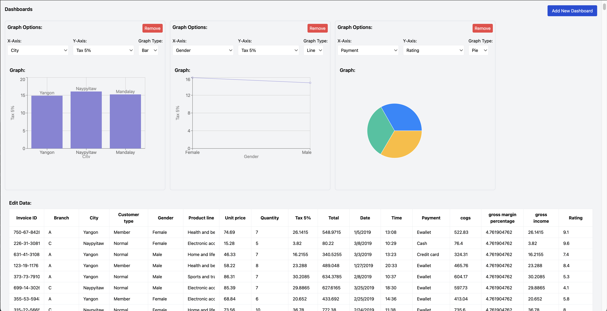

# Responsive Data Dashboard

A responsive data dashboard application that allows users to upload CSV/Excel files, edit data, and dynamically generate and view multiple graphs.

## Features

- **Responsive Layout**: The dashboard layout adapts to different screen sizes, displaying in a row on larger screens and in a column on smaller screens.
- **File Upload**: Users can upload CSV or Excel files to populate the dashboard with data.
- **Data Editing**: Users can edit the data directly within the application.
- **Dynamic Graphs**: Users can create multiple dashboards, each with its own set of graph options and graphs. The graphs update dynamically based on the data changes.

## Screenshot



## Technologies Used

- **React**: A JavaScript library for building user interfaces.
- **TypeScript**: A typed superset of JavaScript that compiles to plain JavaScript.
- **Tailwind CSS**: A utility-first CSS framework for rapidly building custom designs.
- **PapaParse**: A powerful CSV parser for JavaScript.
- **XLSX**: A library for parsing and writing various spreadsheet formats.
- **Recharts**: A composable charting library built on React components.

## Installation

1. Clone the repository:
   ```bash
   git clone https://github.com/smitkevadiya50/Dynamic-graph-generation.git
   cd Dynamic-graph-generation

## Available Scripts

Install the dependencies:

### `npm install`

In the project directory, you can run:

### `npm start`

Runs the app in the development mode.\
Open [http://localhost:3000](http://localhost:3000) to view it in the browser.


## Contributing
Contributions are welcome! Please open an issue or submit a pull request for any bugs, enhancements, or feature requests.

## License
This project is licensed under the MIT License. See the LICENSE file for details.
